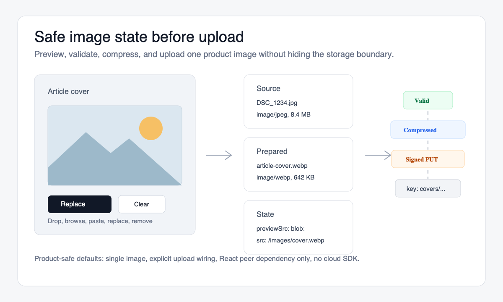

# image-drop-input

[](https://www.npmjs.com/package/image-drop-input)
[](https://github.com/mt4110/image-drop-input/actions/workflows/ci.yml)
[](https://www.npmjs.com/package/image-drop-input)
[](./LICENSE)
[](https://bundlephobia.com/package/image-drop-input)

A product-safe React image field.

Preview locally, prepare to policy, upload explicitly,
and persist only durable image state.

Built for avatars, workspace logos, CMS thumbnails, article covers,
product images, and admin forms. Not generic file queues.

- Persistable value guard: `toPersistableImageValue()` removes temporary `previewSrc` before submit.
- Byte-budget solver: `prepareImageToBudget()` prepares images to fit upload policy.
- Draft lifecycle: `useImageDraftLifecycle()` coordinates draft upload, commit, discard, and previous cleanup.
- Local draft recovery: `createLocalImageDraftStore()` and `useLocalImageDraftRecovery()` add crash-resilient OPFS/IndexedDB recovery for unsaved local drafts.

**Upload success is not product save success.** The package is built around that boundary: browser preview, prepared bytes, draft upload, committed image, and persisted form payload stay separate.

New readers can pick the path that matches their need: local preview, prepared upload, or product-safe replacement.

[Demo](https://mt4110.github.io/image-drop-input/) · [Docs](./docs/README.md) · [Recipes](#recipes) · [Usage reports](https://github.com/mt4110/image-drop-input/issues/new?template=usage-report.yml) · [Japanese README](./README.ja.md) · [Issues](https://github.com/mt4110/image-drop-input/issues)



## Why this exists

A normal file input gives you a `File`. That is useful intake, but it is not product image state.

A product image field usually needs more:

- show a local preview immediately
- reject unsupported types and unsafe sizes
- prepare the image to match an upload byte budget
- keep temporary `blob:` previews and draft objects out of saved state
- upload through signed URLs without bundling a cloud SDK
- separate upload success from the surrounding form save
- recover cleanly when upload fails
- stay keyboard-accessible

`image-drop-input` is a small React image field for that durable image-state boundary.

## Native input vs image-drop-input

| Need | Native `<input type="file">` | `image-drop-input` |
| --- | --- | --- |
| Local preview | Manual object URL handling | Built-in `previewSrc` pattern |
| Validation before and after transform | Manual | Built-in |
| `src` vs `previewSrc` separation | Manual convention | Explicit value model |
| Persistable payload | Manual | `toPersistableImageValue()` |
| Byte-budget preparation | Manual | `prepareImageToBudget()` |
| Draft/commit lifecycle | Manual | `useImageDraftLifecycle()` |
| Signed upload wiring | Manual | Upload adapter contract |
| Paste support | Manual | Included |
| Keyboard and dialog behavior | Browser default only | Included in the default surface |

## Install

```bash
npm install image-drop-input react
```

Import the default CSS once:

```tsx
import 'image-drop-input/style.css';
```

## Browser/client boundary

`ImageDropInput` is a browser component. In Next.js App Router, render it from a Client Component with `'use client'`; keep server work in routes, server actions, or loaders.

The built-in transform helpers use browser image decoding and canvas encoding. Run presign, auth, persistence, and storage policy on the server, but keep `transform` and `previewSrc` handling in the browser. Persist `src`, `key`, and metadata after upload; do not save `previewSrc`.

## Runtime support

The package separates the repo toolchain from the install floor for apps that consume the published tarball.

| Layer | Policy |
| --- | --- |
| Maintainer toolchain | Node 22.x with the npm version pinned by `packageManager`. This is for contributors running the full repo, examples, and release checks. |
| Published package consumers | Node `>=18.18.0` for package install, type resolution, and CJS/ESM subpath loading. React is a peer dependency. |

The library is built to ES2020 and keeps cloud SDKs out of the bundle. CI verifies the packed package in Node 18.18.x, 20.x, and 22.x without running the root repo install in those consumer jobs.

## 30-second quick start

Use it as a local-preview-only image field:

```tsx
import { useState } from 'react';
import { ImageDropInput, type ImageUploadValue } from 'image-drop-input';
import 'image-drop-input/style.css';

export function AvatarField() {
  const [value, setValue] = useState<ImageUploadValue | null>(null);

  return (
    <ImageDropInput
      value={value}
      onChange={setValue}
      accept="image/png,image/jpeg,image/webp"
      aspectRatio={1}
      outputMaxBytes={5 * 1024 * 1024}
    />
  );
}
```

Users can drop an image, browse for one, paste from the clipboard, preview it, and remove or replace it.

## Pick your path

### 1. Local preview only

Use `ImageDropInput` when you just need a single-image field with preview, paste, drag/drop, keyboard access, and safe removal. No upload lifecycle is required.

Start with the [local preview recipe](./docs/recipes/local-preview.md).

### 2. Prepare and upload one image

Add `prepareImageToBudget()` and an explicit upload adapter when the image must fit upload policy before transfer. Upload wiring stays app-owned and explicit.

Start with the [byte-budget guide](./docs/byte-budget.md), [browser budget lab](./docs/browser-budget-lab.md), [presigned PUT recipe](./docs/recipes/presigned-put.md), and [upload docs](./docs/uploads.md).

### 3. Product-safe replacement flow

Use `toPersistableImageValue()` and `useImageDraftLifecycle()` when a draft upload must wait for product save before it becomes persisted state. Add `createLocalImageDraftStore()` and `useLocalImageDraftRecovery()` when the form should offer bounded local recovery after reload or tab crash.

Start with the [draft lifecycle guide](./docs/draft-lifecycle.md), [local draft persistence](./docs/local-draft-persistence.md), [state machine](./docs/state-machine.md), [backend contracts](./docs/backend-contracts.md), and [product submit recipe](./docs/recipes/product-submit-with-image-draft.md).

## Choose image-drop-input when...

Use it when you need one image field whose saved value must stay separate from browser-only preview and draft upload state:

- profile avatar
- workspace logo
- article cover
- CMS thumbnail
- product image
- admin form image

Use a larger upload tool when you need queues, resumable uploads, remote file sources, image editing, or multi-file orchestration.

## What it handles

| Area | What happens |
| --- | --- |
| Input | drop, browse, paste, replace, remove |
| Preview | local `blob:` preview separated from persisted `src` |
| Validation | type, byte budget, dimensions, pixel budget |
| Transform | compress, resize, convert before upload |
| Upload | presigned PUT, multipart POST, raw PUT, custom adapter |
| Accessibility | keyboard operation, paste support, dialog focus behavior |
| Packaging | React peer dependency only, no cloud SDK, no UI framework |

## The durable image boundary

Browser image inputs create temporary values: `File`, `Blob`, object URLs, upload progress, and draft objects.

Your database should store durable values: `src`, `key`, and prepared metadata.

`image-drop-input` gives you helpers to keep that boundary explicit: sanitize submit payloads with `toPersistableImageValue()`, prepare files with `prepareImageToBudget()`, opt into `useImageDraftLifecycle()` when upload success must remain separate from form save success, and add `useLocalImageDraftRecovery()` when an unsaved local draft should be recoverable after reload or tab crash.

Client sanitization is UX. Server validation is authority. Mirror the submit-boundary rules on the server with the [Zod schema recipe](./docs/recipes/server-persistable-image-zod.md) or the [custom validator recipe](./docs/recipes/server-persistable-image-custom.md).

## The image state model

The component value models both display state and durable references, but those are not the same thing.

```ts
type ImageUploadValue = {
  src?: string;        // persisted or shareable image URL
  previewSrc?: string; // temporary local preview, usually blob:
  key?: string;        // object key from your storage layer
  fileName?: string;
  mimeType?: string;
  size?: number;
  width?: number;
  height?: number;
};
```

```txt
selected local file     -> previewSrc
successful upload URL   -> src
storage object key      -> key
failed upload           -> previous committed value remains safe
```

`blob:` URLs are for UI feedback. They are not database values.

Read the full state model in [docs/value-model.md](./docs/value-model.md).

## Persist only durable image state

Before a form payload reaches your API, strip browser-only preview fields and reject temporary image URLs:

```tsx
import { toPersistableImageValue } from 'image-drop-input';

async function submitProfile() {
  const image = toPersistableImageValue(value);

  await fetch('/api/profile', {
    method: 'POST',
    headers: { 'Content-Type': 'application/json' },
    body: JSON.stringify({ image })
  });
}
```

`toPersistableImageValue()` never returns `previewSrc`, rejects `blob:` / `filesystem:` / `data:` `src` values by default, and accepts durable `src` or `key` references.

Read the submit-boundary guide in [docs/persistable-value.md](./docs/persistable-value.md).

## Validation and byte limits

Validation runs before and after `transform`.

| Prop | Stage | Use case |
| --- | --- | --- |
| `inputMaxBytes` | before transform | reject huge source files |
| `outputMaxBytes` | after transform | enforce upload budget |
| `maxBytes` | both | compatibility shortcut |

```tsx
import { ImageDropInput } from 'image-drop-input';
import { prepareImageToBudget } from 'image-drop-input/headless';

<ImageDropInput
  inputMaxBytes={20 * 1024 * 1024}
  outputMaxBytes={500_000}
  transform={async (file) => {
    const prepared = await prepareImageToBudget(file, {
      outputMaxBytes: 500_000,
      outputType: 'image/webp',
      maxWidth: 1600,
      maxHeight: 1600
    });

    return {
      file: prepared.file,
      fileName: prepared.fileName,
      mimeType: prepared.mimeType
    };
  }}
/>
```

Dimension and pixel-budget validation also runs after `transform`, so `onChange` receives metadata for the prepared file.

Read the details in [docs/validation.md](./docs/validation.md) and the deterministic byte-budget guide in [docs/byte-budget.md](./docs/byte-budget.md).

## Upload recipes

Upload wiring is explicit by design. The package does not create signed URLs, bundle provider SDKs, or infer public URLs from upload URLs.

```tsx
import { ImageDropInput } from 'image-drop-input';
import { createPresignedPutUploader } from 'image-drop-input/headless';

const upload = createPresignedPutUploader({
  async getTarget(file, context) {
    const response = await fetch('/api/uploads/presign', {
      method: 'POST',
      headers: { 'Content-Type': 'application/json' },
      body: JSON.stringify({
        fileName: context.fileName,
        originalFileName: context.originalFileName,
        mimeType: context.mimeType ?? file.type,
        size: file.size
      })
    });

    if (!response.ok) {
      throw new Error('Failed to create upload URL.');
    }

    return response.json();
  }
});

<ImageDropInput value={value} onChange={setValue} upload={upload} />;
```

Your endpoint should return `publicUrl` or `objectKey` explicitly:

```ts
type PresignedPutTarget = {
  uploadUrl: string;
  headers?: Record<string, string>;
  publicUrl?: string;
  objectKey?: string;
};
```

See [docs/uploads.md](./docs/uploads.md) for presigned PUT, multipart POST, raw PUT, custom adapters, progress, and abort behavior.

For product forms that upload a temporary draft and only make it durable when the form is saved, keep the backend lifecycle in your app: [backend contracts](./docs/backend-contracts.md), [backend reference protocol](./docs/backend-reference-protocol.md), [draft lifecycle](./docs/draft-lifecycle.md), [state machine](./docs/state-machine.md), and the [Next.js draft lifecycle recipe](./docs/recipes/nextjs-draft-lifecycle.md).

## Upload error handling

Built-in upload helpers throw `ImageUploadError` with stable `code` and `details` fields. Use `isImageUploadError()` for product copy, retry labels, and telemetry instead of parsing English messages.

```tsx
import { ImageDropInput, isImageUploadError } from 'image-drop-input';

function toUploadMessage(error: Error) {
  if (!isImageUploadError(error)) {
    return 'Could not prepare this image.';
  }

  if (error.code === 'http_error' && error.details.status === 413) {
    return 'This image is too large for the upload endpoint.';
  }

  if (error.code === 'network_error') {
    return 'The network dropped the upload. Please try again.';
  }

  return 'Image upload failed. Please try again.';
}

<ImageDropInput
  value={value}
  onChange={setValue}
  upload={upload}
  onError={(error) => {
    if (isImageUploadError(error)) {
      reportUploadFailure({
        code: error.code,
        stage: error.details.stage,
        status: error.details.status
      });
    }
  }}
/>;
```

The default UI can retry failed uploads without rerunning `transform`. Headless UIs get the same flow through `canRetryUpload` and `retryUpload()`.

## Transform recipes

Use `transform` when you want to resize, compress, or convert the image before preview and upload.

```tsx
import { compressImage } from 'image-drop-input/headless';

<ImageDropInput
  value={value}
  onChange={setValue}
  accept="image/png,image/jpeg,image/webp"
  transform={async (file) => ({
    file: await compressImage(file, {
      maxWidth: 1600,
      maxHeight: 1600,
      outputType: 'image/webp',
      quality: 0.86
    }),
    fileName: file.name.replace(/\.(png|jpe?g|webp)$/i, '.webp'),
    mimeType: 'image/webp'
  })}
/>
```

Explicit `outputType` requests are checked after canvas encoding. If the browser cannot encode the requested type, `compressImage()` rejects instead of returning mismatched bytes and MIME metadata.

Read more in [docs/transforms.md](./docs/transforms.md).

## Recipes

- [Persistable value](./docs/persistable-value.md)
- [Byte-budget solver](./docs/byte-budget.md)
- [Browser budget lab](./docs/browser-budget-lab.md)
- [Backend contracts](./docs/backend-contracts.md)
- [Backend reference protocol](./docs/backend-reference-protocol.md)
- [Draft lifecycle](./docs/draft-lifecycle.md)
- [Draft lifecycle state machine](./docs/state-machine.md)
- [Server persistable image schema with Zod](./docs/recipes/server-persistable-image-zod.md)
- [Server persistable image schema without dependencies](./docs/recipes/server-persistable-image-custom.md)
- [Product submit with image draft](./docs/recipes/product-submit-with-image-draft.md)
- [Local preview](./docs/recipes/local-preview.md)
- [Avatar field](./docs/recipes/avatar.md)
- [Compression](./docs/recipes/compression.md)
- [WebP transform](./docs/recipes/webp.md)
- [Presigned PUT](./docs/recipes/presigned-put.md)
- [Next.js App Router](./docs/recipes/nextjs-app-router.md)
- [Next.js presign route](./docs/recipes/nextjs-presign-route.md)
- [Next.js draft lifecycle](./docs/recipes/nextjs-draft-lifecycle.md)
- [React Hook Form and Zod](./docs/recipes/react-hook-form-zod.md)
- [Multipart POST](./docs/recipes/multipart-post.md)
- [Raw PUT](./docs/recipes/raw-put.md)
- [Headless UI](./docs/recipes/headless-ui.md)

## How it fits with other upload tools

Use Uppy, FilePond, Uploady, or provider widgets when you need queues, remote sources, resumable uploads, image editing, or storage-as-a-service.

Use `image-drop-input` when you need one image field that keeps browser-only preview state, draft upload state, and persisted product state separate.

| Need | Good fit |
| --- | --- |
| Custom file intake/drop area | `react-dropzone` or a headless file-upload primitive |
| Multi-file queues, retries, remote sources, or editors | Uppy, FilePond, Uploady, or a provider widget |
| Single-image form field with a durable image-state boundary | `image-drop-input` |

Maintainers use the [maintenance governance guide](./docs/maintenance-governance.md) to evaluate whether new requests deepen this boundary or belong in app code and dedicated uploader/editor tools.

## Accessibility

The default component includes keyboard operation, paste support, action labels, status text, and a focus-managed preview dialog. The headless hook exposes the same behavior when you need custom markup.

Read the checklist in [docs/accessibility.md](./docs/accessibility.md).

## API

| Import | Exports |
| --- | --- |
| `image-drop-input` | `ImageDropInput`, UI props and render types, `ImageUploadValue`, persistable value helpers, upload types, validation and upload error helpers |
| `image-drop-input/headless` | `useImageDropInput`, `useImageDraftLifecycle`, `compressImage`, `prepareImageToBudget`, `validateImage`, metadata helpers, upload factories, budget/validation/upload error helpers |
| `image-drop-input/style.css` | default component styles |

```ts
import {
  ImageDropInput,
  ImageValidationError,
  isImageUploadError,
  isImageValidationError,
  type ImageDropInputProps,
  type ImageUploadValue,
  type UploadAdapter
} from 'image-drop-input';
```

```ts
import {
  ImageBudgetError,
  compressImage,
  createMultipartUploader,
  createPresignedPutUploader,
  createRawPutUploader,
  isImageBudgetError,
  prepareImageToBudget,
  useImageDraftLifecycle,
  useImageDropInput,
  validateImage,
  type ImageDraftDescriptor,
  type UseImageDropInputReturn
} from 'image-drop-input/headless';
```

The root entry stays UI-first. Low-level utilities live under `/headless`.

## Adoption evidence

The project values concrete integration signals over download counts.

Current repo-maintained evidence includes the [integration report](./docs/integration-report.md), which documents the single-image product form boundary against shipped APIs. It is not production-adjacent evidence or a customer endorsement.

The [durable image boundary](./docs/durable-image-boundary.md) explains the category, non-goals, and evidence map.
The [claim ledger](./docs/claim-ledger.md) maps public claims to evidence,
disproof paths, and proof status.
It keeps the project honest about what is proven, partially proven, or not proven yet.

Current external evidence includes a maintainer-owned [Next.js draft lifecycle demo](https://github.com/mt4110/image-drop-input-next-draft-demo) that installs `image-drop-input` from npm by version. That proves repo-external package consumption, not third-party adoption.

No public non-maintainer usage report is linked yet. The project should not claim third-party adoption or production-adjacent usage until a report from outside the maintainer workflow supports that label.

Using this package in a product, internal tool, or external demo, or evaluating it for one? Open a [usage report](https://github.com/mt4110/image-drop-input/issues/new?template=usage-report.yml) or respond from the [external usage report request](https://github.com/mt4110/image-drop-input/issues/51) so docs, compatibility, and release polish can be prioritized from concrete integration context. Useful reports include the relationship, use case, framework or bundler, package source, upload pattern, what worked, and anything that slowed adoption. Critical feedback is welcome, and public quotation is opt-in.

See [docs/adoption-evidence.md](./docs/adoption-evidence.md) for what repo-maintained examples, maintainer-owned demos, third-party reports, and production-adjacent case studies prove.

## When not to use this

Use another tool if you need:

- multi-file queues
- resumable or chunked uploads
- remote file sources
- drag sorting between lists
- full crop, rotate, or annotation editing
- provider-specific SDK wrappers
- storage-as-a-service behavior
- Node-side image processing

This package is intentionally single-image first.

## Development

Development uses the maintainer toolchain above, which is intentionally stricter than the consumer install floor.

```bash
npm ci
npm run typecheck
npm test
npm run build:lib
npm run build:examples
npm run check:package
npm run publish:check
```

Release planning stays outside the npm package, so this README can stay focused on what works today.

## License

MIT
